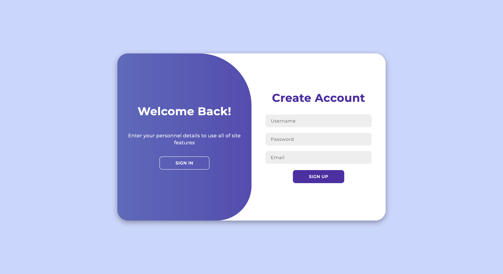
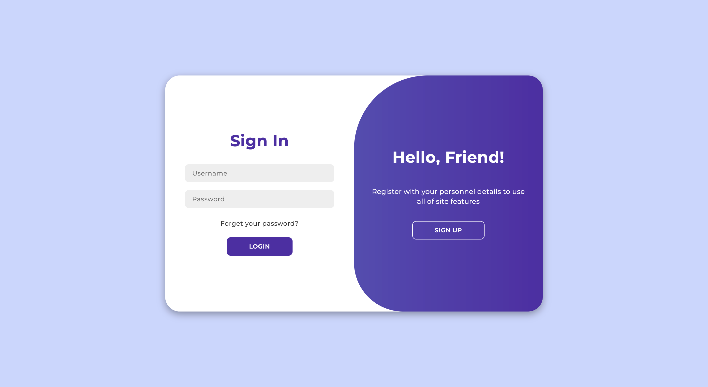
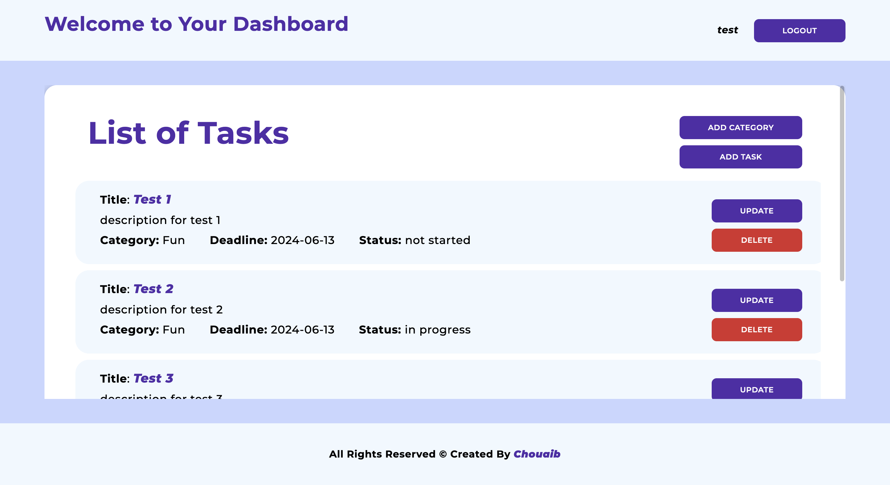

# PHP Task Manager

A simple task manager application built with PHP to help you manage your tasks efficiently. This project includes features such as user authentication, adding, updating, deleting tasks, and categorizing tasks.

## Features

- User Authentication (Signup and Login)
- Add, Update, and Delete Tasks
- Categorize Tasks
- Set Task Deadlines
- Logout Functionality

## Technologies Used

- PHP
- MySQL
- HTML
- CSS
- JavaScript

## Installation

1. **Clone the repository:**

```bash
git clone https://github.com/chouaib-629/taskManager.git
```

2. **Navigate to the project directory:**

```bash
cd taskManager
``` 

3. **Run the application:**

    1. **Start your local server** (e.g., XAMPP, MAMP).
    2. **Set up the database**:
        - Open your database management tool (e.g., phpMyAdmin).
        - Run the `db/schema.sql` script provided in the project directory to set up the database and tables.
    3. **Configure the database connection:**
        - Update the `dbHandler.inc.php` file with your MySQL database credentials.

        ```php
        <?php
        $host = 'your_host';
        $db = 'taskManager';
        $user = 'your_username';
        $pass = 'your_password';

        $dsn = "mysql:host=$host;dbname=$db";
        $options = [
            PDO::ATTR_ERRMODE            => PDO::ERRMODE_EXCEPTION,
            PDO::ATTR_DEFAULT_FETCH_MODE => PDO::FETCH_ASSOC,
            PDO::ATTR_EMULATE_PREPARES   => false,
        ];

        try {
            $pdo = new PDO($dsn, $user, $pass, $options);
        } catch (\PDOException $e) {
            throw new \PDOException($e->getMessage(), (int)$e->getCode());
        }
        ```
4. **Navigate to the project directory:** 
    - Open your web browser and go to `http://localhost/taskManager` (or the appropriate path for your setup).

## Usage

### Signup

1. Fill in the username, email, and password fields.
2. Click the "Signup" button.

### Login

1. Fill in the username and password fields.
2. Click the "Login" button.

### Dashboard

1. Add new categories and tasks.
2. Update or delete existing tasks.
3. Logout when you're done.

## Screenshots

Here are some screenshots of the application:

### Signup Page


### Login Page


### Dashboard


## Contributing

We welcome contributions! Please follow these steps:

1. Fork the repository.
2. Create a new branch (`git checkout -b feature-branch`).
3. Commit your changes (`git commit -m 'Add new feature'`).
4. Push to the branch (`git push origin feature-branch`).
5. Open a Pull Request.

## Contact Information

For questions or support, please contact [Me](mailto:chouaiba629@gmail.com).